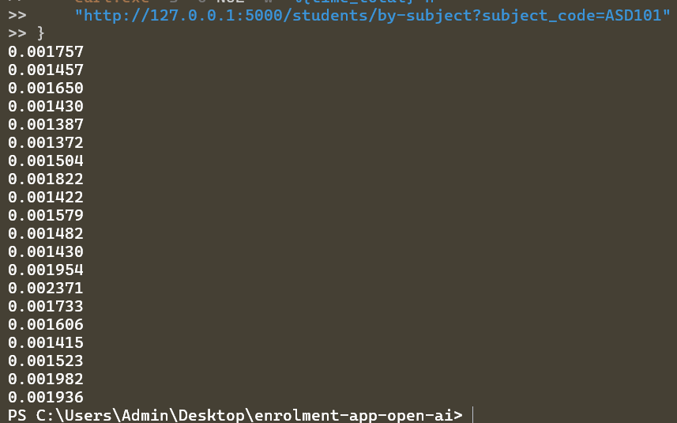

Evidence log 2

Pass condition satisfied by the script.

| Check | Expected Result | Actual Result | Pass/Fail |
|---|---|---|---|
| AI configuration guide completed | Qwen and Llama setup completed | All were completed | Pass |
| Ollama installed | `ollama --version` works | Version is valid | Pass |
| Qwen model installed | `ollama list` shows `qwen2.5:0.5b` | Shows this version | Pass |
| Llama model installed | `ollama list` shows `llama3.1:8b` | Shows this version | Pass |
| Database created | `enrolment.db` exists | database present in directory | Pass |
| Seed data | 10 students | Seeded data successfully | Pass |
| Flask app runs | `http://127.0.0.1:5000` opens | Local host works | Pass |
| Baseline `/students` | 10 students returned | API Route functions as intended | Pass |
| Baseline `/students/1` | Student returned | The GET student route works | Pass |
| New `/students/by-subject?subject_code=ASD101` | Matching students returned | Matching students returned i.e. John Smith | Pass |
| New `/students/by-subject?subject_code=ABC999` | No students found message returned | | |
| HTMX subject search | Browser form returns matching students | | |
| Implementation agent | Qwen recommendation returned or unavailable message shown | | |
| Review agent | Llama review returned or unavailable message shown | | |
| Human review | AI recommendation assessed | | |
| NFR | 19/20 subject-search requests <= 0.500s | | |
| Adapt | One improvement applied | | |
