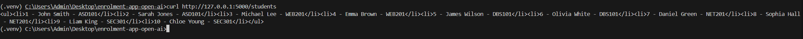
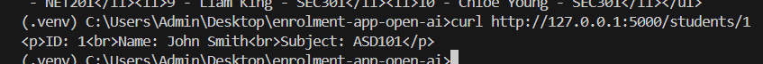
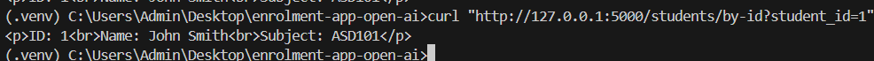
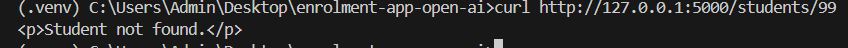
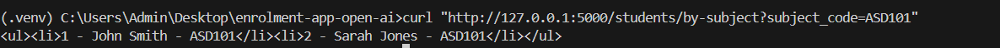
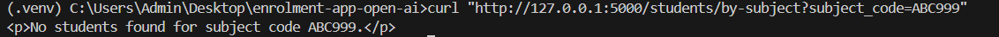
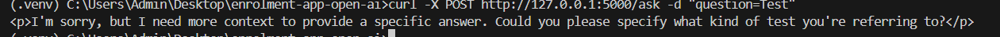
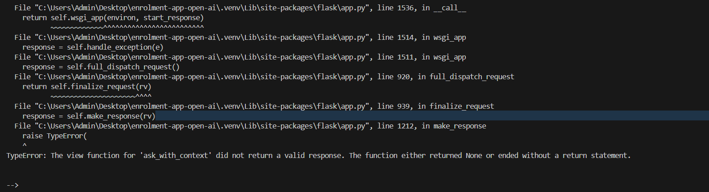
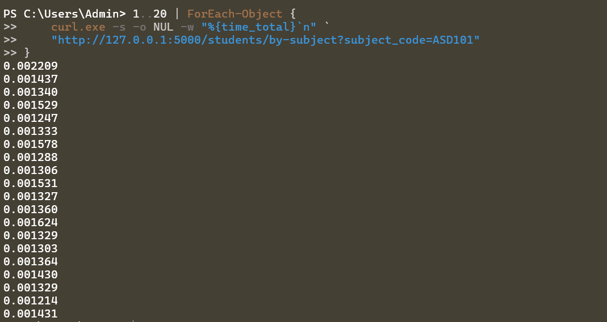

## View Students endpoint

## Get student endpoint

## Get student by ID endpoint

## Get student API with non-existent student ID route parameter

## Search by subject endpoint

## Search by subject endpoint with non-existent route parameter

## Submit home page form 

## Submit context form
Initial state because of the lack of implementation:

which is expected.

## NFR validation via a shell script

All requests were completed in under 0.500 seconds, as expected. This is a 
locally hosted server after all.

First loop I chose to accept as there was an implementation agent recommendation 
being incomplete.

The second rerun was a reject response as the schema already enforeced data uniqueness 
in the SQLite tables. Thus, was deemed unnecessary.

| Check | Expected Result | Actual Result | Pass/Fail |
|---|---|---|---|
| Prompt folder created | Yes | Created | PASS |
| Prompt files created | Yes | Created | PASS |
| qwen2.5:0.5b installed | Yes | Installed | PASS |
| llama3.1:8b installed | Yes | Installed | PASS |
| Context form added to frontend | Yes | Added | PASS |
| Task 1: /ask-with-context works | Yes | Yes | Pass |
| NFR: by-subject <= 500ms (19/20 requests) | Pass | Yes | PASS |
| Task 2: Agentic loop live endpoint checks | All HTTP 200 | Yes | PASS |
| Task 2: Implementation agent output | Returned | Returned the suggestions on the console | PASS |
| Task 2: Review agent output | Returned | Returned suggestions as required | PASS |
| Task 3: Prompt fix applied and rerun | Recorded | YES | PASS |
| Task 3: /ask endpoint responds after fix | HTTP 200, no timeout | There were no required fixes in the first place | PASS |
| Task 3: Human decision recorded | Recorded | YES | PASS |
